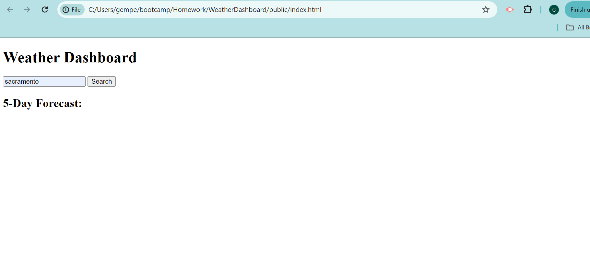

# WeatherDashboard

## Description

This application is designed to provide users with up-to-date weather information for cities around the world. Whether you're planning your day, week, or a trip to another city, this app offers comprehensive weather data to help you stay prepared.

## Table of Contents

- [Installation](#installation)
- [Usage](#usage)
- [License](#license)
- [Contributing](#contributing)
- [Links](#links)
- [Questions](#questions)

## Installation

## Usage

## License

This project is licensed under the MIT license.

## Contributing

Gabby

## Screenshot

## Links

Link to deployed app: https://gemperador.github.io/WeatherDashboard/

Link to repo: https://github.com/gemperador/WeatherDashboard

## Questions

For any questions, you can contact me via:

- GitHub: [gemperador](https://github.com/gemperador)

- Email: [email](gabriemperador@gmail.com)
